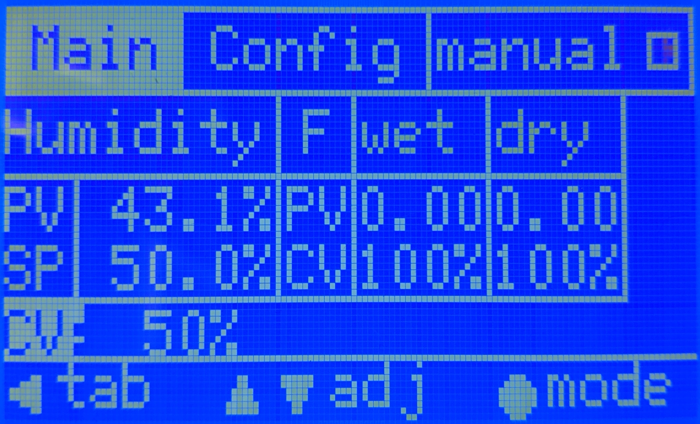
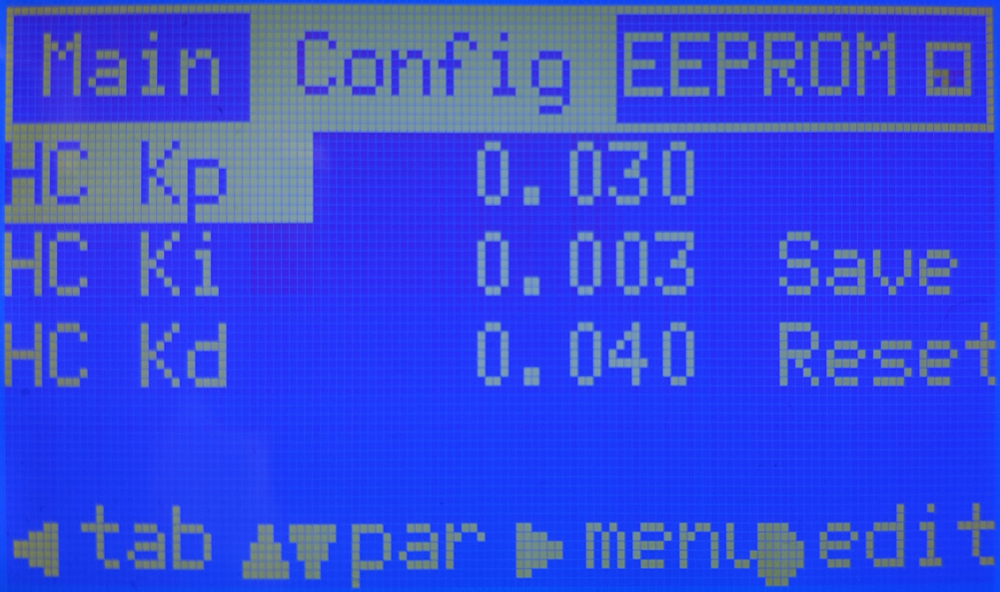
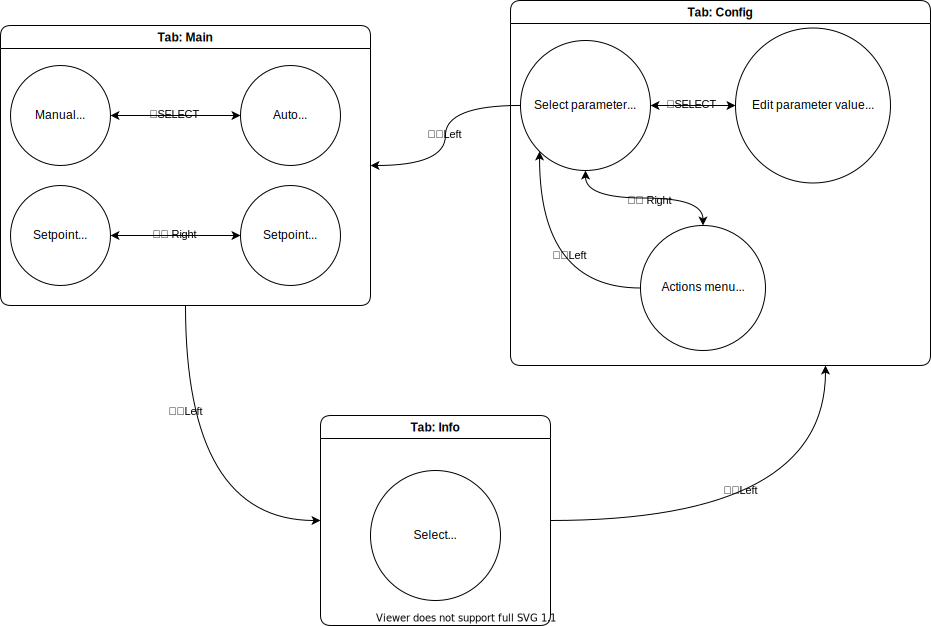

# OpenHumidistat


[](https://zenodo.org/badge/latestdoi/288475918)

This repository contains the Arduino firmware that implements a humidistat (humidity controller) by actuating two
solenoid valves. The firmware can be used on a variety of 
[Arduino-compatible boards](https://docs.platformio.org/en/latest/frameworks/arduino.html#boards), but is developed for
 and tested on the following two MCU boards:

- Arduino Uno (AVR ATmega328P)
- Teensy LC (ARM Cortex-M0+)


Besides the Arduino firmware, it contains a real-time monitoring/logging tool written in Python, which communicates 
with the MCU over serial.

## Arduino
### Dependencies
[PlatformIO Core](https://docs.platformio.org/en/latest/core/installation.html) is required for building the firmware.

### Configuration
The firmware is written in a modular way in order to ensure compatibility with multiple MCUs, sensors, controller 
types, and even UIs, while still keeping to a single shared codebase and avoiding code duplication. In order to configure the firmware, edit `src/config.h`.
This file contains macros that control which modules are used, and a number of configurable constants.

#### Humidistat type
This firmware contains two variants of the actual humidity controller: `SingleHumidistat` and `CascadeHumidistat`.

The former implements a single-loop PID controller that regulates the humidity by directly driving two solenoid 
valves.

In contrast, the latter implements cascade PID control: the outer humidity control loop adjusts the setpoints 
of two inner (flow) control loops, that in turn drive a solenoid valve each. This control scheme leads to improved 
stability and performance, but requires flow sensors to provide feedback to the inner controllers.

To use the single-loop control, uncomment the line that defines `HUMIDISTAT_CONTROLLER_SINGLE`. To use cascade control, 
uncomment the line that defines `HUMIDISTAT_CONTROLLER_CASCADE`. In the latter case, Omron D6F-P0010 flow sensors must 
be connected to (analog input) pins defined by `PIN_F1` and `PIN_F2`.

#### Humidity sensor type
Two types of humidity sensors are supported: the DHT22/AM2302 sensors, and the Sensirion SHT85. The former uses an 
ad-hoc single-wire protocol, and can be connected to any digital input pin (as defined by `PIN_DHT`). The latter 
communicates over I2C, and as such must be connected to the MCU's hardware I2C bus.

To use the DHT22/AM2302 sensor, uncomment the line that defines `HUMIDISTAT_DHT`. For the SHT85, uncomment the line 
that defines `HUMIDISTAT_SHT`.

#### Keypad type
For input, two keypads are supported: the keypad integrated on the Keyestudio Ks0256 LCD1602 Expansion Shield, and the 
Keyestudio Ks0466 Button Module (or clones). Both are 5-button (direction + select) resistance ladders, but their 
button-resistance mappings differ.

To use the keypad integrated on the Keyestudio Ks0256, uncomment the line that defines `HUMIDISTAT_INPUT_KS0256`. 
For the Ks0466, uncomment the line that defines `HUMIDISTAT_INPUT_KS0466`.

#### UI type
This firmware comes with two separate UIs: one for a (HD44780-style) 16x2 character display called `CharDisplayUI`, 
and a more elaborate UI for a (ST7920) 128x64 graphical display called `GraphicalDisplayUI`.

For the `GraphicalDisplayUI`, in turn two variants exist (implemented as specialisations of the templatised class): 
one for the aforementioned `SingleHumidistat` and `CascadeHumidistat`. This makes for a grand total of three 
existing UI variants. (due to its limited space, there is no UI for the `CascadeHumidistat` for the 16x2 character 
display)

To use the 16x2 character display, uncomment the line that defines `HUMIDISTAT_UI_CHAR`. For the 128x64 graphical 
display, uncomment the line that defines `HUMIDISTAT_UI_GRAPH`.

> :exclamation: Because of the ATmega328P's limited memory (both flash and RAM), the `GraphicalDisplayUI` cannot be 
> used on the Arduino Uno. By extension, since the `CharDisplayUI` doesn't support `CascadeHumidistat`, 
> `CascadeHumidistat` unfortunately cannot be used on the Arduino Uno.

#### Constants
Besides the macros discussed above, `config.h` contains a list of compile-time constants that you want to check and 
possible modify. Some of these are customisable by the operator on the device itself, using the EEPROM, if the 
`GraphicalDisplayUI` is used.

- Serial symbol rate
- EEPROM settings
- Arduino I/O pin numbers (for sensor, buttons, LCD, solenoid valves, thermistors)
- PID/logger/sensor interval
- PID parameters:
  - Low CV value (deadband)
  - Gains (Kp, Ki, Kd, Kf)
- UI/input settings

Make sure to set these parameters to their appropriate values before compilation.

### Installation
With the MCU board connected over USB, compile the firmware and upload it to the MCU:

```console
foo@bar:~$ platformio run --target upload
```

### Usage
#### CharDisplayUI
On powerup, the MCU shows a splash screen followed by an info screen printing the active tuning parameters.
Subsequently, the system is ready for use. An outline of the UI is shown below.


The values shown on the display are:

- Mode: 0 for manual, 1 for auto.
- PV: Process variable, i.e. the current, measured humidity in the chamber.
- SP: Setpoint, i.e. the desired humidity. This blinks if it is too far from the PV.
- CV: Control variable, representing the state of the valves from 0 to 100%.
- MOSFET/Solenoid temperatures in Celsius.
- Chamber temperature in Celsius.

It starts in manual (open-loop) mode by default. Press SELECT to switch the
controller into auto mode. Press LEFT/RIGHT for coarse adjustment of the setpoint, and DOWN/UP for fine adjustment. In
manual mode, the same buttons are used to adjust the control variable.

#### GraphicalDisplayUI
The GraphicalDisplayUI is a modal UI with two tabs: `Main` and `Config` (shown in the bar at the very top of the 
screen). The `Main` tab is open by default. In this tab, the :arrow_up_down:`up`/`down` buttons adjust the currently 
selected variable. Long presses give faster repeat speed.



When the controller is in `manual`, the control variable (`CV`) is the selected variable. In `auto`, the setpoint 
(`SP`) is the selected variable. To toggle between `manual` and `auto` mode, press the :black_circle:`select` button.

To switch to the other tab, press the :arrow_left:`left` button.



In the config tab, a number of controller parameters can be adjusted from the defaults as configured in `src/config.
h`, and saved in EEPROM.

In this tab, the :arrow_up_down:`up`/`down` buttons scroll through the list of parameters. 
To edit a parameter, press :black_circle:`select`. Now, the :left_right_arrow:`left`/`right` buttons can be used to 
select the digit to adjust with :arrow_up_down:`up`/`down`. Press :black_circle:`select` again to confirm.

With :arrow_right:`right`, the menu can be reached. In this menu, the current settings can be applied and saved to 
EEPROM, or reset from the defaults stored in flash memory.



## Serial monitor
The device can operate fully in a standalone manner, but it is possible to connect it to a PC over serial (USB)
running a Python script for real-time monitoring and recording of data.

### Dependencies
The serial monitor requires at least Python 3.6. It depends on Numpy and Pandas for data structures, on PySerial for
communicating with the OpenHumidistat MCU, and on Matplotlib and PyQt5 for plotting.

The dependencies can be installed in a virtualenv using Pipenv:

```console
foo@bar:~$ pipenv install
foo@bar:~$ pipenv shell
(OpenHumidistat) foo@bar:~$ 
```

If you do not have Pipenv, you can install with `pip install pipenv`.

### Usage
With the Arduino connected over USB, run the serial monitor:

```console
foo@bar:~$ pipenv shell
(OpenHumidistat) foo@bar:~$ utils/monitor.py
```

The Arduino will reset when the serial port is opened. After connection is established, a window will open in which the
data is plotted in real-time.

When the serial monitor is closed (by SIGINT), it will save the data to file, in (gzipped) CSV format.

## Developer documentation
Developer documentation is available at https://compizfox.github.io/OpenHumidistat/.

## Publication
The device for which this firmware is intended, is described in the following paper:

Veldscholte, L.B., Horst, R.J. & de Beer, S.  
Design, construction, and testing of an accurate low-cost humidistat for laboratory-scale applications.  
Eur. Phys. J. E 44, 48 (2021).  
https://doi.org/10.1140/epje/s10189-021-00062-5

## License
This project is free software licensed under the GPL. See [LICENSE](LICENSE) for details.
